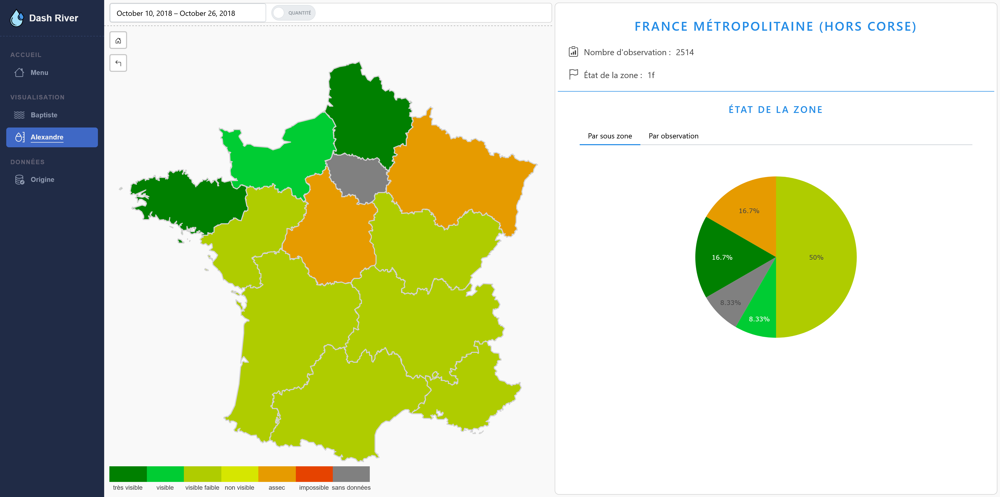
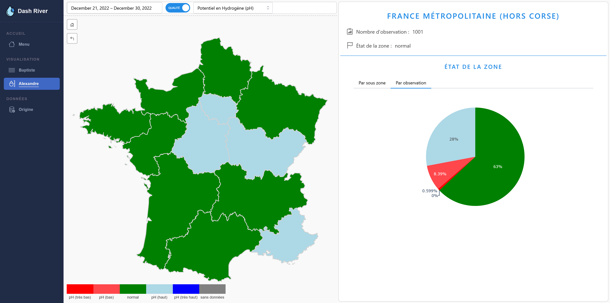
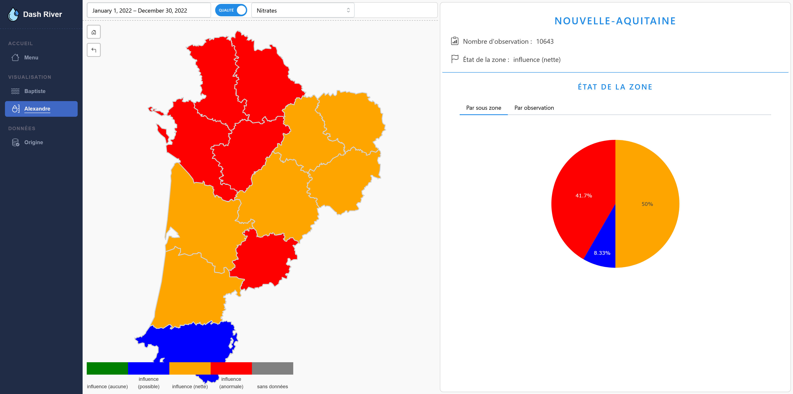
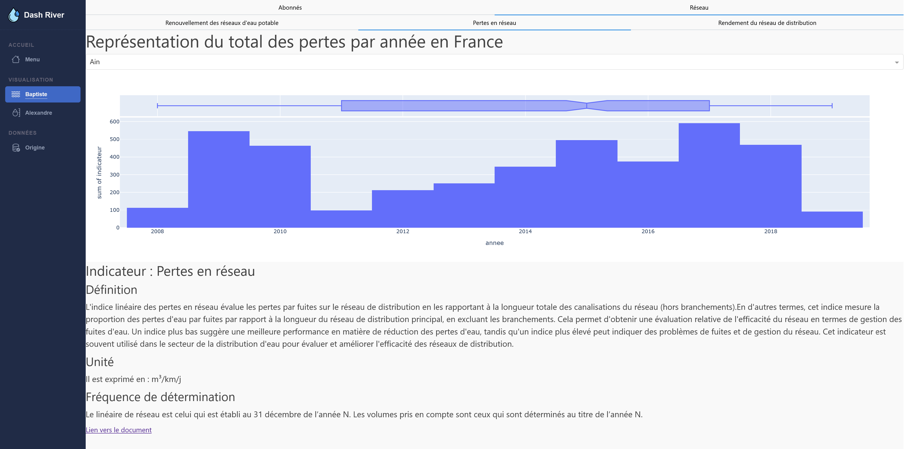

# Projet de visualisation analytique

## 🌟 Introduction

Bienvenue dans notre application, l'objectif de cette analyse est de comprendre comment l'eau est gérée en France métropolitaine hors Corse. C'est avec plaisir que nous vous invitons à explorer toutes les facettes de notre site (**Dashboard**) ainsi qu'à faire vos analyses grâce aux nombreux graphiques et cartes que l'on vous propose.

## ⚙️ Installation

1) Téléchargez toutes les bibliothèques que nous utiliserons avec la commande :  
`pip install -r requirements.txt`.

2) Pour télécharger les données dans **une base de données MongoDB**, il faut exécuter le fichier `download_data.py`. Le temps de téléchargement est d'environ ~30 min. 

3) Enfin, lancez le fichier Python `app.py` et le tour est joué !

Vous pouvez visualiser le site à partir du lien suivant lorsque `app.py` est lancé : http://127.0.0.1:8050/

## ❔ Informations sur nos APIs :

Pour réaliser ce projet, nous avons utilisé 3 APIs via le site Hub'eau :

* Écoulement des cours d'eau : https://hubeau.eaufrance.fr/page/api-ecoulement  
* Qualité des cours d'eau : https://hubeau.eaufrance.fr/page/api-qualite-cours-deau  
* Indicateurs des services : https://hubeau.eaufrance.fr/page/api-indicateurs-services  

Nous avons récupéré des fichiers JSON, GeoJSON. Pour chaque API, nous avons décidé de sélectionner plusieurs fichiers et avons déjà fait la sélection des paramètres qui seront utiles à notre analyse. Cela nous évitera de télécharger des données pour rien ! Pour voir quels paramètres nous avons utilisés, nous vous invitons à vous rendre au fichier `config.ini` qui est dans le dossier `download` du dossier `data`.

## 📈 Extraits du Dashboard

## 📝 Conclusion

En conclusion, nous avons fait des progrès significatifs en Python, notamment dans la conception et la réalisation de Dashboards interactifs. Nous avons acquis une compréhension approfondie de l'optimisation des connexions aux API et de la gestion d'une base de données **MongoDB**. Grâce à ces compétences, nous avons développé un outil puissant capable de visualiser divers indicateurs relatifs à la disponibilité de l'eau en France, offrant ainsi une meilleure compréhension sur cette ressource essentielle.

## 👥 Auteurs

- Baptiste Gerbouin
- Alexandre Leys